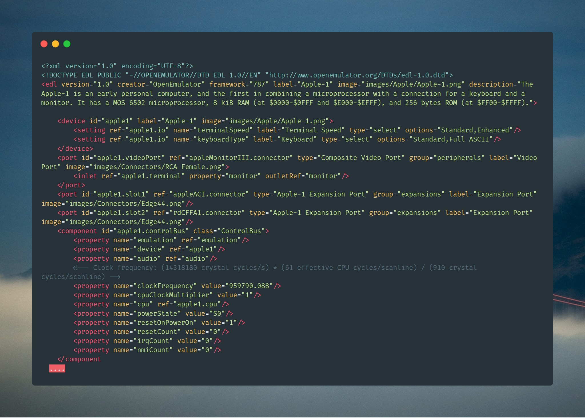

    

----

**libemulation** is an emulation framework of legacy computer systems powering emulators such as [OpenEmulator](https://github.com/openemulator/openemulator).

  * Implemented in C++
  * Portable, accurate emulation framework
  * Large, diverse component library
  * Emulates famous legacy computers, such as the Apple II and more.
  * Easy to create emulations using [EDL](doc/The%20libemulation%20Book.txt), or Emulation Description Language.

## Usage
libemulation is implemented in C++ and can be linked with your emulator application as a static library. We aim to be portable, but currently the only offically supported and tested platform is macOS. Refer to [INSTALL.md](INSTALL.md) for instructions how to build libemulation.

## Feedback and contributing
If you find a bug, or would like a specific feature, please report it at:

[https://github.com/openemulator/libemulation/issues](https://github.com/openemulator/libemulation/issues)

If you like to contribute to the project, fork the repository on Github and send us your pull requests!
